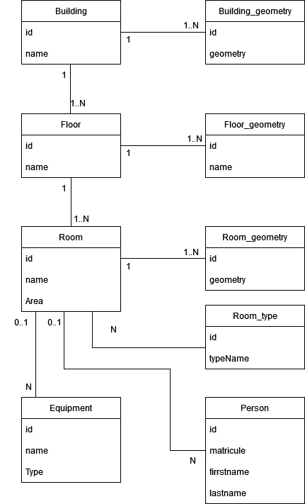

# Plan HEIG-VD

## Description

This project is an interactive map for the **HEIG-VD** school

It contains four directories :

- 01_doc is the administrative document for the project.
- 02_plan isn't available on the public repository. It contains the geographical data used to create the application.
- 03_code contain the Server API, the frontend, and sqlScriptCreator, a program that convert an arborescence of files to SQL scripts.
  - [Frontend](https://gitlab.com/tb-heig/plan-heig-vd/-/tree/dev/03_code/frontend)
  - [Server API](https://gitlab.com/tb-heig/plan-heig-vd/-/tree/dev/03_code/serverAPI)
  - [sqlScriptCreator](https://gitlab.com/tb-heig/plan-heig-vd/-/tree/dev/03_code/sqlScriptCreator)
- 04_deploy contain the files to deploy the application on a virtual machine

## Installation

To install the project on your local machine :

1. Clone the project in your local files
2. Install PostgreSQL with the extension Postgis
3. Create the postgres user and choose a password
4. Go, with a terminal, to 04_deploy/sql folder
5. Run the command below to create the database (note the third command take a moment to complete)

```
psql -U postgres -a -f 01_init.sql --quiet
psql -U postgres -a -f 02_create.sql --quiet
psql -U postgres -a -f 03_insert.sql --quiet
```

6. Follow the installation instruction of frontend [here](https://gitlab.com/tb-heig/plan-heig-vd/-/blob/dev/03_code/frontend/readme.md)
7. Follow the installation instruction of serverAPI [here](https://gitlab.com/tb-heig/plan-heig-vd/-/blob/dev/03_code/serverAPI/README.md)
8. The application is available on `localhost:3000`

To deploy the project :

1. Install Docker engine on the machine you want to deploy
2. After you cloned the project go to the folder 04_deploy
3. create a .env file and copy the following code below inside.

```
DB_PASSWORD="yourPassword"
HOST= "yourDomain.web"
```

4. Adjust the parameters as you want
5. copy, if necessary, the docker-compose.yml file, the .env file and the sql folder on the distant machine.
6. Run on the distant machine the command `docker-compose --env-file ./.env up`
7. Wait (the creation of the database takes a certain time)

## Database architecture



## Abstract (french)

Les plans d’architecte ont été un support fondamental pour l’orientation des personnes au sein d’un bâtiment. Avec l’arrivée du web, l’usage d’applications orientées « plan » remplace peu à peu les plans physiques, offrant de nouvelles fonctionnalités plus interactives.

Sur les différents sites de la HEIG-VD, aucune application de plans n’existe pour aider à l’orientation des étudiants ou collaborateurs vers les salles ou les ressources.

Ce projet met en place un prototype d’application interactive afin de permettre une visualisation des plans du site de Cheseaux à Yverdon-Les-Bains.
Il a été réalisé en trois grandes étapes :

- Une analyse des besoins des utilisateurs, des technologies et des systèmes existants afin de déterminer les exigences.
- La conception du projet afin de répondre à ces exigences.
- La réalisation du projet qui consiste à
  - Traiter les plans ;
  - Créer de nouvelles données géographiques ;
  - Créer une base de données ;
  - Créer l’application ;
  - Déployer l’application sur une machine virtuelle.

L’application répond aux exigences et démontre la faisabilité d’un tel projet pour l’ensemble des sites de la HEIG-VD.
